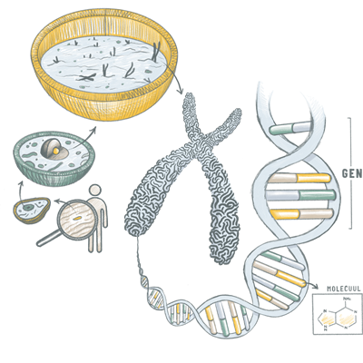
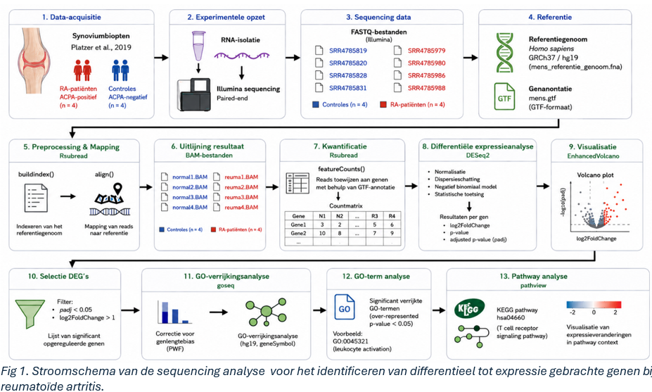
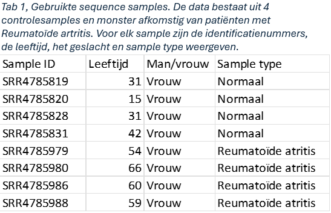
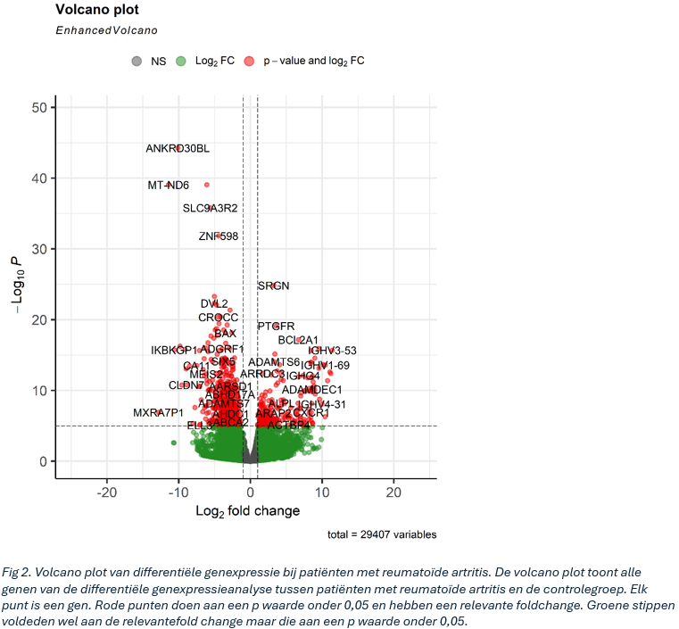
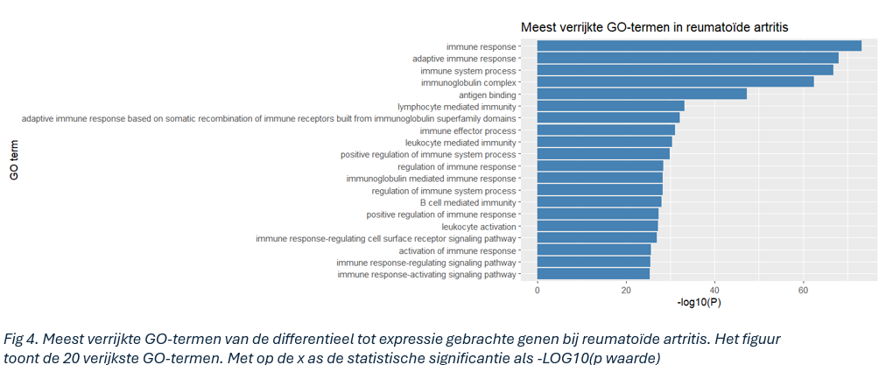
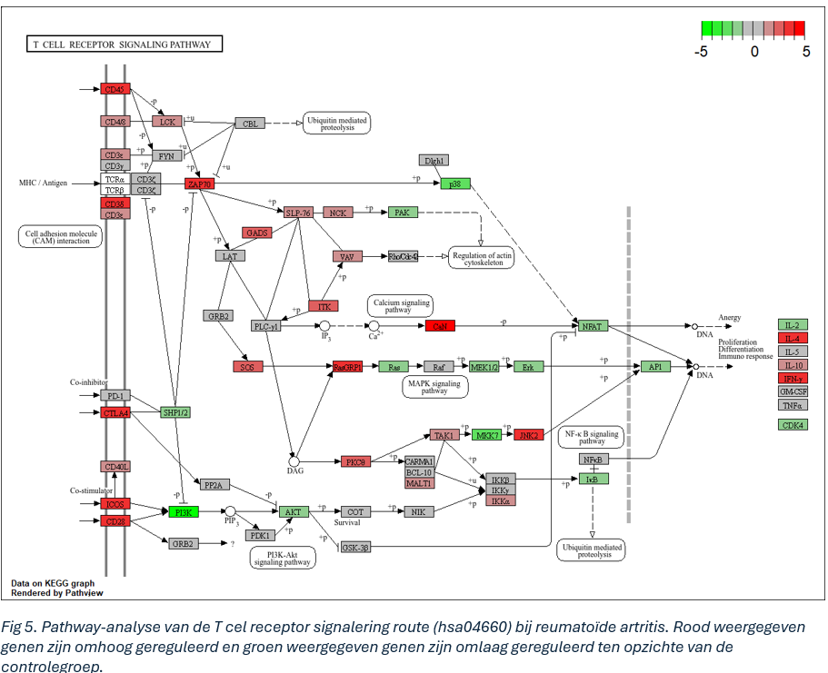

# Analyse van genexpressie, biologische processen en T cell receptor signalerings pathway van patiënten met reumatoïde artritis ten opzichte van gezonde patiënten. 

  

## 📁 Inhoud/structuur

- `Ruwe data` – Bevat de Ruwe sequencing data    
- `BAM` - Bevat de verkregen Bam files 
- `Count matrix` – Bevat de gebruikte count matrix
- `Referentie` - Bevat de referentie bestanden
- `Resulaten` - Bevat de verkregen resultaten
- `README.md` - Het document om de tekst hier te genereren
- `assets` - overige documenten voor de opmaak van deze pagina
- `data_stewardship` - Voor de competentie beheren 
- `gitatributes` - Voor het doorsturen van grotere bestanden

## Inleiding

Reumatoïde artritis is een chronische auto-immuunziekte die aanhoudende ontstekingen aan gewrichten veroorzaakt. Deze ontstekingen kunnen lijden tot pijn en zelfs beschadiging van kraakbeen en bot. Wereldwijd heeft ongeveer 0,3 tot 1% van de bevolking Reumatoïde artritis. De exacte oorzaak van reumatoïde artritis is niet bekend[(1)](https://pmc.ncbi.nlm.nih.gov/articles/PMC5385708/?). Wel spelen erfelijke factoren[(2)](https://www.vzinfo.nl/reumatoide-artritis/oorzaken-en-gevolgen) en een verstoord immuunsysteem een grote rol bij het ontstaan van de ziekte. 
Eerdere genexpressie onderzoeken hebben aangetoond dat patiënten met reumatoïde artritis afwijkende genexpressie vertonen vergeleken met gezonde mensen. Deze verschillen worden voornamelijk gevonden in genen die betrokken zijn bij het immuunsysteem, zoals genen die betrokken zijn bij de activatie van immuuncellen en ontstekingsreacties[(3)](https://pmc.ncbi.nlm.nih.gov/articles/PMC6657850/#pone.0219698.ref003). Deze resultaten suggereren dat de veranderingen in genexpressie bijdragen tot het verstoorde immuunsysteem wat een grote rol speelt bij het ontstaan van de ziekte.
Het doel van deze studie is om verschillen in genexpressie tussen patiënten met reumatoïde artritis en gezonde mensen te identificeren en de betrokken biologische processen te visualiseren. Dit is gedaan door eerst een volcanoplot te maken van de expressie van alle genen ten opzichte van de controles, daarna een GO analyse uit te voeren om veranderde biologische processen te bepalen en uiteindelijk een pathway analyse te maken om de verandering van biologische processen te visualiseren. 

## Materiaal en methode

Voor dit onderzoek is gebruikgemaakt van data uit een eerder onderzoek van [(Platzer et al., 2019)](https://pubmed.ncbi.nlm.nih.gov/31344123/). De monsters waren afkomstig van synoviumbiopten van patienten met reumatoïde artritis en gezonde controles. De patiënten met reumatoïde artritis waren positief getest op ACPA, terwijl de controlegroep ACPA negatief was. De reads werden verkregen met Illumina sequencing.
De opbouw van de volledige analysemethode is weergegeven in figuur 1.

    

### Mappen en kwantificatie van de reads

Alle analyses werden uitgevoerd in R (versie 4.5.3). Om de data te kunnen analyseren, werd eerst het [humane referentiegenoom](https://www.ncbi.nlm.nih.gov/datasets/taxonomy/9606/) geïndexeerd met de package [Rsubread](https://pubmed.ncbi.nlm.nih.gov/30783653/) (versie 2.24.0). Vervolgens werden de reads van alle monsters (tabel 1) uitgelijnd tegen het referentiegenoom met behulp van dezelfde package. Na het uitlijnen werden de reads per gen geteld. Hierbij werd gebruikgemaakt van een [annotatiebestand](https://www.ncbi.nlm.nih.gov/datasets/taxonomy/9606/), zodat de reads aan de juiste genen konden worden gekoppeld. De resulterende aantallen werden opgeslagen in een count matrix, die gebruikt kon worden voor de differentiële genexpressieanalyse. Deze stappen zijn uitgevoerd met het [script mappen en kwantificeren](script/script_mappen_en_kwantificeren.R).

  

### Differentiële genexpressie analyse

Om verschillen in genexpressie tussen patiënten met reumatoïde artritis en gezonde controles te bepalen, werd de count matrix geanalyseerd met het pakket [DESeq2](https://www.bioconductor.org/packages//2.12/bioc/vignettes/DESeq2/inst/doc/DESeq2.pdf) (versie 1.50.2). Eerst werd de dataset voorbereid en omgezet naar een DESeqDataSet-object. Vervolgens berekende [DESeq2](https://www.bioconductor.org/packages//2.12/bioc/vignettes/DESeq2/inst/doc/DESeq2.pdf) (versie 1.50.2) voor ieder gen de log2 fold change, de p-waarde en de voor multiple testing gecorrigeerde p-waarde (adjusted p-value). Genen met een gecorrigeerde p-waarde kleiner dan 0,05 werden beschouwd als differentieel tot expressie gebracht. Om de resultaten overzichtelijk weer te geven, werd een volcanoplot gemaakt met het pakket [EnchancedVolcano](https://pmc.ncbi.nlm.nih.gov/articles/PMC12263102/) (versie 1.28.2). Deze analyse is uitgevoerd met [script Differentiële gen expressie analyse](script/script_Differentiële_genexpressie_analyse.R) en [script volcanoplot](script/script_volcanoplot.R).
### GO-analyse

Om inzicht te krijgen in de biologische processen die samenhangen met de gevonden differentieel tot expressie gebrachte genen, werd een Gene Ontology (GO)-analyse uitgevoerd. Hiervoor werden alleen genen geselecteerd met een log2 fold change groter dan 1. De dataset werd eerst bewerkt met de package [Dplyr](https://dplyr.tidyverse.org/ ) (versie 1.2.1). Vervolgens werd met de packages [goseq](https://www.researchgate.net/publication/238769214_goseq_Gene_Ontology_testing_for_RNA-seq_datasets) (versie 1.62.0) en [genelendatabase]( https://www.researchgate.net/publication/238769214_goseq_Gene_Ontology_testing_for_RNA-seq_datasets) (versie 1.46.0) een PWF-object aangemaakt op basis van het humane genoom hg19. Dit PWF-object corrigeert voor verschillen in genlengte, waardoor de GO-analyse betrouwbaarder wordt. Daarna werd de GO-analyse uitgevoerd met het [script Go analyse](script/script_Go_analyse.R). De resultaten werden gevisualiseerd in een staafdiagram met behulp van [ggplot2](https://link.springer.com/book/10.1007/978-3-319-24277-4) (versie 4.0.3) en het [script staafdiagram GO analyse](script/script_staadiagram_GO_analyse.R).
### Pathway analyse
Om de resultaten van de GO-analyse verder biologisch te interpreteren, werd een pathwayanalyse uitgevoerd. Eerst werden de genen behorend bij de verrijkte GO-term GO:0045321 opgehaald met behulp van het [script welke genen bij GO term](script/script_welke_genen_bij_GO_term.R), de package [AnnotationDbi](https://bioconductor.posit.co/packages/release/bioc/vignettes/AnnotationDbi/inst/doc/IntroToAnnotationPackages.pdf) (versie 1.72.0) en de annotatiedatabase [org.Hs.eg.db](https://bioconductor.statistik.tu-dortmund.de/packages/3.6/bioc/html/OrganismDbi.html) (versie 3.22.0). Vervolgens werd vastgesteld dat een groot deel van deze genen betrokken is bij de T-cell receptor-signaleringsroute (KEGG-pathway [hsa04660]((https://www.genome.jp/dbget-bin/www_bget?pathway+hsa04660 )). Daarom werd deze pathway geselecteerd voor verdere analyse. Met het [script pathway analyse](script/script_pathway_analyse.R) werd onderzocht welke genen binnen deze signaalroute differentieel tot expressie kwamen. 

## 📊 Resultaten

### Groot verschil in genexpressie tussen patienten met reumatoïde artritis en gezonde controles 

Uit de resultaten van de differentiële genexpressie analyse bleken 5119 genen differentieel tot expressie zijn gebracht. Hiervan waren er 2085 meer dan verdubbeld en 2487 meer dan gehalveerd in expressie. Om dit te visualiseren is er een volcano plot gemaakt waarin alle geteste genen staan met hun log2foldchange en hun gecorrigeerde p waarde 

  

### Verrijking van het immuunsysteem

In Figuur 4 is een te zien waarin de meest statistisch significante  verrijkte GO-termen. In de diagram valt op dat elke verrijkte GO-term te maken heeft het immuunsysteem. Ook valt te zien dat de 2 meest statistisch significante verrijkte GO-termen allebei over het immuun respons gaan. 

  

### Sterke activatie van T cellen

In figuur 5 is de pathway analyse van de T cell receptor signalerings patway te zien. Hierin valt op dat genen betrokken bij T cel activatie (CD28, ZAP70, ICOS en IFN-γ) sterk verhoogd tot expressie kwamen wat kan leiden tot het produceren van ontstekingsreacties. Ook lijkt de cel groei proliferatie verminderd te worden door omlaag gereguleerde bijbehorende genen (IL-2, AKT, ERK en CDK4)

  

## Conclusie
Het doel van dit onderzoek was om verschillen in genexpressie tussen patiënten met reumatoïde artritis en gezonde personen te identificeren en de betrokken biologische processen te onderzoeken en visualiseren. In dit onderzoek is gevonden dat er 5119 genen differentieel tot expressie kwamen. Hiervan hadden 2085 genen meer dan een verdubbeling in expressie en 2487 genen minder dan een halvering in expressie.

De GO-analyse toonde aan dat de differentieel tot expressie gebrachte genen voornamelijk betrokken zijn bij processen van het immuunsysteem. Wat erop wijst dat veranderingen in immuunprocessen een belangrijke rol spelen bij reumatoïde artritis. 

Daarnaast liet de analyse van de T-cell receptor signaleringsroute zien dat genen die betrokken zijn bij T-celactivatie verhoogd tot expressie kwamen. Deze resultaten ondersteunen de resultaten van de GO analyse en benadrukt de aanwezigheid van T-cellen bij reumatoïde artritis.

Op basis van deze resultaten kan worden geconcludeerd dat er duidelijke verschil is tussen genexpressie van patiënten met reumatoïde artritis en gezonde personen. Ook laten de analyses zien dat deze verschillen voornamelijk met de biologische processen van het immuunsysteem te maken hebben. Hierdoor is het doel van het onderzoek behaald door het verschil in gen expressie te identificeren en het verschil van biologische processen te visualiseren.

## Bronnenlijst
uo, Q., Wang, Y., Xu, D., Nossent, J., Pavlos, N. J., & Xu, J. (2018). Rheumatoid arthritis: Pathological mechanisms and modern pharmacologic therapies. Bone Research, 6(1), 15. https://doi.org/10.1038/s41413-018-0016-9 

Rijksinstituut voor Volksgezondheid en Milieu. (z.d.). Reumatoïde artritis: Oorzaken en gevolgen. VZinfo. Geraadpleegd op 19 juni 2026, van https://www.vzinfo.nl/reumatoide-artritis/oorzaken-en-gevolgen 

Lin, Y.-J., Anzaghe, M., & Schülke, S. (2020). Update on the pathomechanism, diagnosis, and treatment options for rheumatoid arthritis. Cells, 9(4), 880. https://doi.org/10.3390/cells9040880 

National Center for Biotechnology Information. (z.d.). Homo sapiens (human), taxonomy ID 9606. National Library of Medicine. Geraadpleegd op 19 juni 2026, van https://www.ncbi.nlm.nih.gov/datasets/taxonomy/9606/ 

Love, M. I., Huber, W., & Anders, S. (z.d.). DESeq2 vignette. Bioconductor. Geraadpleegd op 19 juni 2026, van https://www.bioconductor.org/packages//2.12/bioc/vignettes/DESeq2/inst/doc/DESeq2.pdf 

Wickham, H., François, R., Henry, L., Müller, K., & Vaughan, D. (z.d.). dplyr: A grammar of data manipulation. https://dplyr.tidyverse.org/ 

Young, M. D., Wakefield, M. J., Smyth, G. K., & Oshlack, A. (2010). Gene ontology analysis for RNA-seq: Accounting for selection bias. Genome Biology, 11(2), R14. https://doi.org/10.1186/gb-2010-11-2-r14 

Wickham, H. (2016). ggplot2: Elegant graphics for data analysis (2e ed.). Springer. https://doi.org/10.1007/978-3-319-24277-4 

Pagès, H., Carlson, M., Falcon, S., & Li, N. (z.d.). Introduction to Bioconductor annotation packages. Bioconductor. Geraadpleegd op 19 juni 2026, van https://bioconductor.posit.co/packages/release/bioc/vignettes/AnnotationDbi/inst/doc/IntroToAnnotationPackages.pdf 

Bioconductor Project. (z.d.). OrganismDbi: Smooth interfacing of different database packages. Geraadpleegd op 19 juni 2026, van https://bioconductor.statistik.tu-dortmund.de/packages/3.6/bioc/html/OrganismDbi.html 

Kanehisa Laboratories. (z.d.). KEGG pathway: T cell receptor signaling pathway (hsa04660). Kyoto Encyclopedia of Genes and Genomes. Geraadpleegd op 19 juni 2026, van https://www.genome.jp/dbget-bin/www_bget?pathway+hsa04660

### AI gebruik
In dit verslag is er voor het vinden van de bronnen, het maken van een bronnen lijst en het zoeken voor een pathway gebruikt gemaakt van ai. Voor de rest heeft ai geholpen met het interpreteren van de resultaten en het helpen bij problemen met het script schrijven. 

